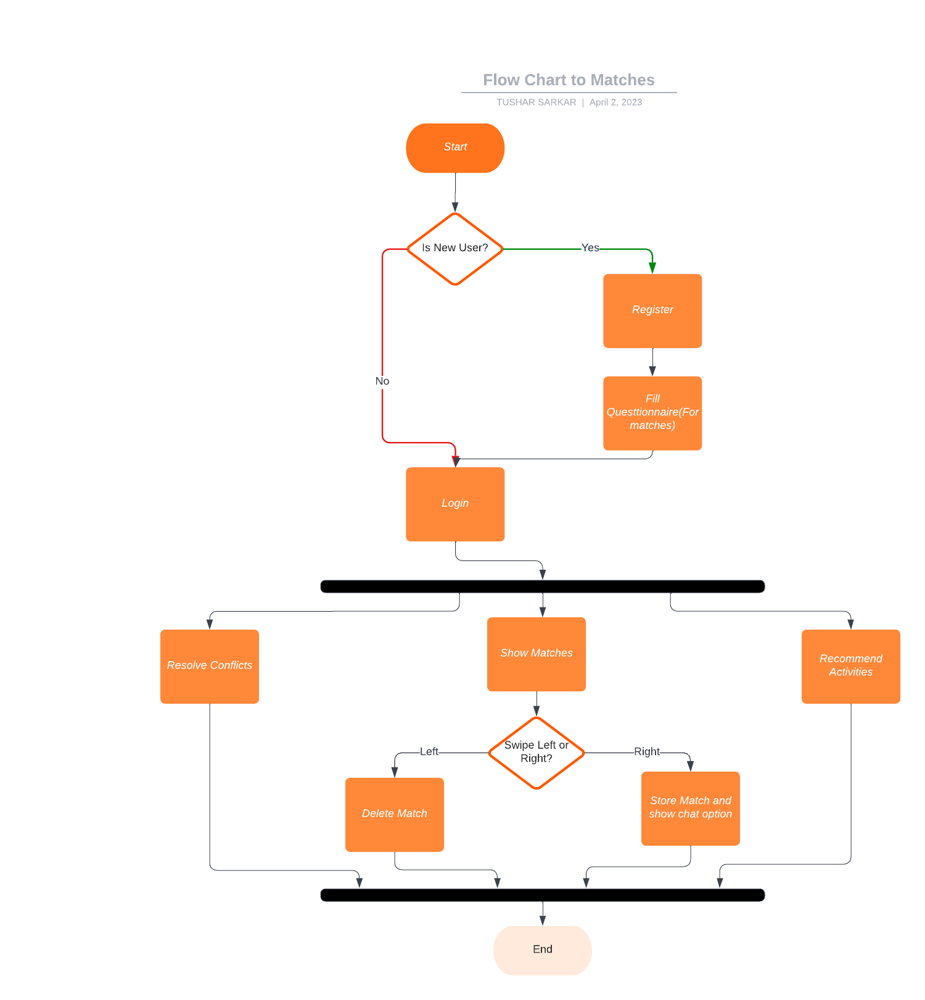
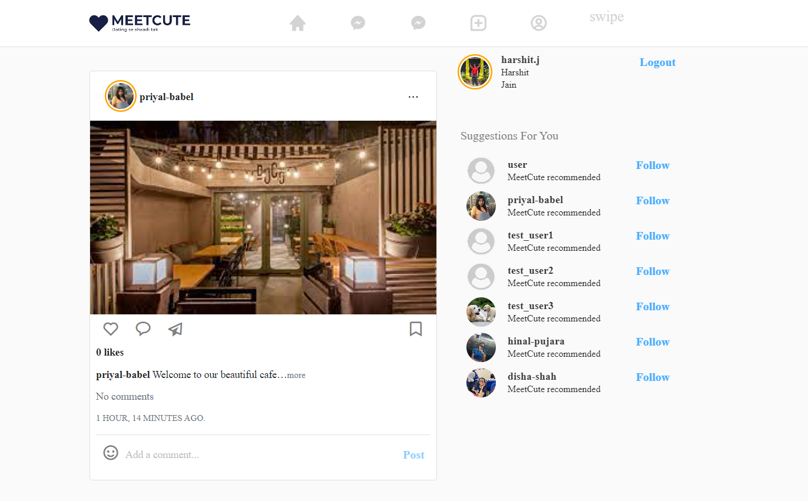
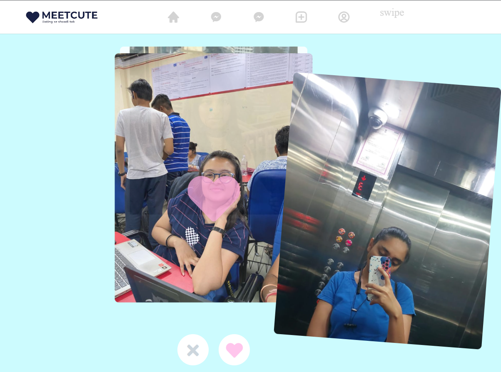
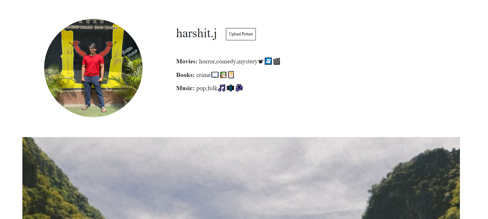

# MeetCute - Relationship Builder
## Confluence of the Indian culture with the Western influence


## Problems that we are solving:
- Bad matching algorithms.
- Limited scope
- Freemium models

## Our proposed solution:
- Physical, psychological(MBTI) and astrological features.
- Help in relationship management
- Free for the user

## Features

- New matching algorithm: A new algorithm designed for the best matches.
- Conflict resolution: Helping users during tough times of their relationship.
- Activity recommendations: Suggesting enjoyable activities and places for a couple based on their interests
---
### Installation :
```
git clone https://github.com/tusharsarkar3/Hack_7.git
```

```
cd Hack_7 && pip install -r requirements.txt
```

```
python manage.py runserver
```
---

### Flowchart :
 
---

### Output images :

  


---

---
 #### Features to be added :
- Audio/Video call
- Coversation starter and builder

---

<h3 align="center"><b>Developed with :heart: by MindMantra</a>
